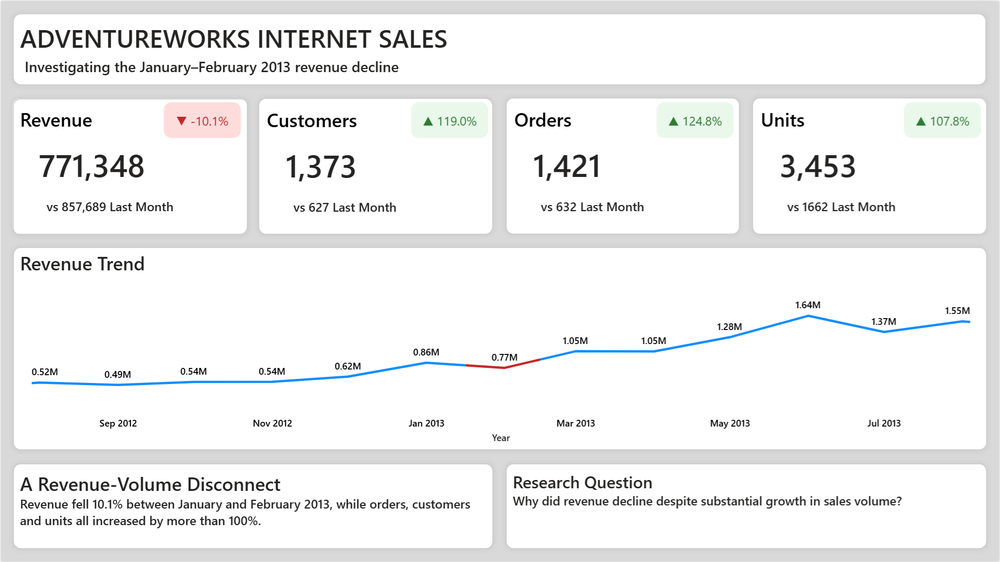
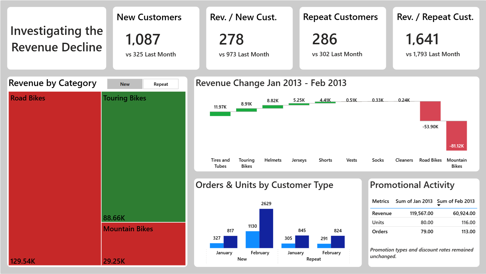

# AdventureWorks Sales Analysis

## Overview

A cloud-based analysis of AdventureWorks Internet sales, using Google Cloud Platform (BigQuery) and Power BI to investigate a significant discrepancy between sales volume and revenue.

### Business Question

Between January and February 2013: 
- Revenue decreased by 10.1%
- Customers increased by 119%
- Orders increased by 124.8%
- Units increased by 107.8%

So, why did revenue decrease despite the massive increase in orders, customers, and units?

## Dashboard 

### Initial Exploration

### Investigation 

